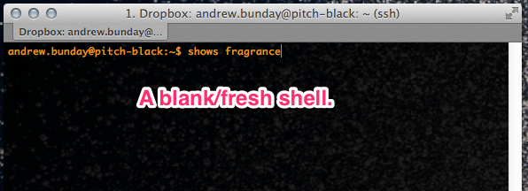
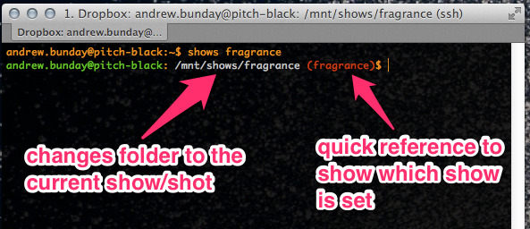
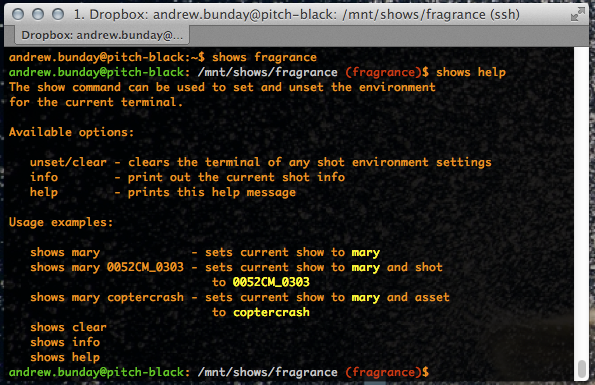
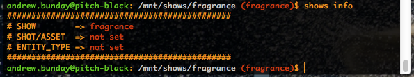
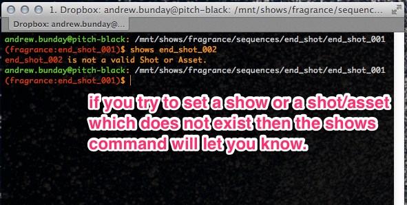
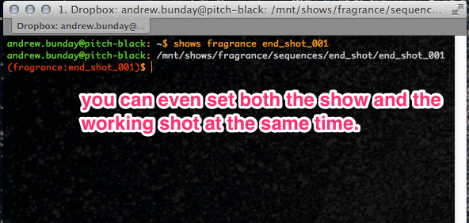
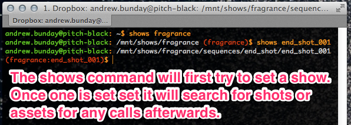
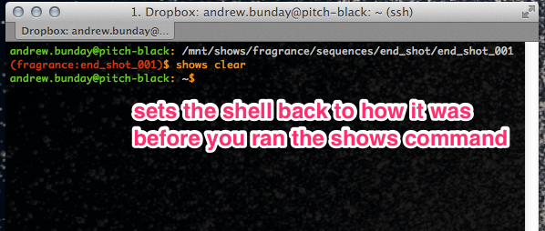

## Background

For as long as I can remember I've tried to steer away from the dreaded 'job shell'. But the time has come for me to finally accept that you cannot fight something like it forever. Simply put without having one I've been held back in the development of tools as each tool has had to manage the ability to be called for multiple shows and shots.

Rather than destroying the current shell, here we stash those variables we're going to overwrite such as the CWD and SHOW/SHOT and PS2 and restore them once we're done. The purpose of the shell is to setup the environment to allow the asset managment command to be run. The command is configured indepentantly of the job shell allowing us to have a clean and consistant launch environment.

## Usage

Here are a few pics which should hopefully help to show whats going on.



*to setup the shell type 'shows' and the name of the show*



*you can see that the command has worked because the prompt will be updated to reflect the new settings*



*at any time you can type 'shows help' to bring up usage examples*



*and if you still aren't sure which show/shot or asset you are current set to you can ask for info*



*shots can also be set using the command, either after the show has been set as in this example*



*or at the same time as setting the show*



*if you try to set a show, shot or asset which doesn't exist a warning will be given*



*this wouldn't be a clean tool if you couldn't undo any changes it has made*. *Typing clear will reset the shell*

## Make it, Install it, Publish it 

````bash
$ make - builds the contents of src into a deb package using fpm. 
         control information is stored in ./info

$ make install - installs the last build deb package onto the localhost.

$ make publish - publishes the last build deb package to the site apt repository
````
